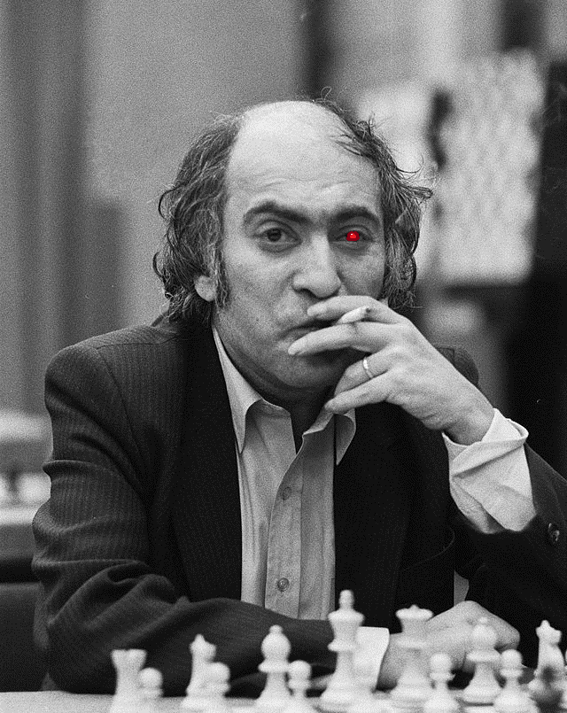

### Destroy chess.com with this extension+server solution.

What you need - just clone the repo, up the flask server and install the extension into your chrome.

STOCKFISH NEEDED.

This is the beta version of alpha version (just wrote some code and played some matches in chess.com, with a fresh account ofc)

### TODOs
1. Refactoring of the extension, since I'm a backend dev and feeling a little nauseous when working with the front
2. Perhaps some refactoring is needed on the server side. I did it quickly, to try as soon as possible
3. Have some kind of session - when the match started - create a board and just do moves, instead of creating a board every time when there is a new move
4. Automation on FE - do not click the button each time when there is a new move from your opponent, but detect it and send a POST req to the server
5. From fantastic genre: when received a response from server - do a move automatically without user action. By that way you just can start the game and leave your PC and go to play some real chess with a real person on a real chess board